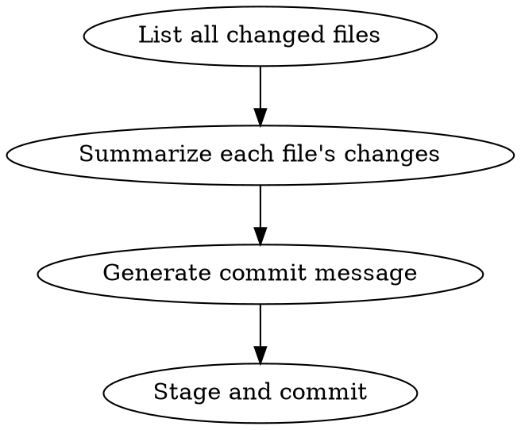

# Git Commit

Create a commit with meaningful, structured commit messages by analyzing all changes before committing.

## When to Use

- User says "commit", "commit code", "save changes", "create commit"
- Before saving work that needs a descriptive history
- When preparing to push changes

## Process



### Steps

1. **Check for JIRA ticket** (optional)
   - If user provides JIRA ticket ID, note it for prepend to message
   - Format: `#<jiraId>: <message>`

2. **List all changed files**
   ```bash
   git status --short
   git diff --name-only
   ```

3. **Get detailed diff for each file**
   ```bash
   git diff [file]
   ```

4. **Summarize changes per file**
   - What was added, modified, or deleted
   - Group by logical purpose

5. **Generate commit message**
   - If JIRA ticket exists: prepend `#<jiraId>: ` to first line
   - First line: Summary of all changes (50 chars max, not counting JIRA prefix)
   - Body: Per-file change descriptions

6. **Stage and commit**
   ```bash
   git add [files]
   git commit -m "message"
   ```

## Commit Message Format

**要求使用中文描述提交内容**

```
#<jiraId>: <简短总结，50字符以内>

- [file]: <变更描述，使用中文>
- [file]: <变更描述，使用中文>
```

**Note:** If no JIRA ticket provided, omit the `#<jiraId>:` prefix entirely.

## Example

```
#PROJ-123: 添加用户认证和错误处理

- [src/auth.js]: 添加登录/登出功能
- [src/api.js]: 添加 API 调用的错误处理
- [package.json]: 添加认证相关依赖
```

## Common Mistakes

| Mistake | Fix |
|---------|-----|
| Generic message ("update files") | Be specific about what changed |
| Committing without reviewing | List files first, review diffs |
| Forgetting to stage | Use `git add` before `git commit` |
